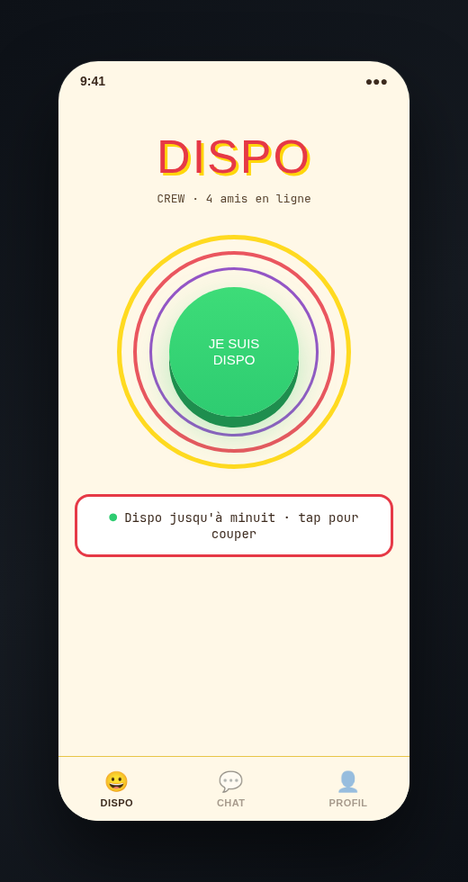
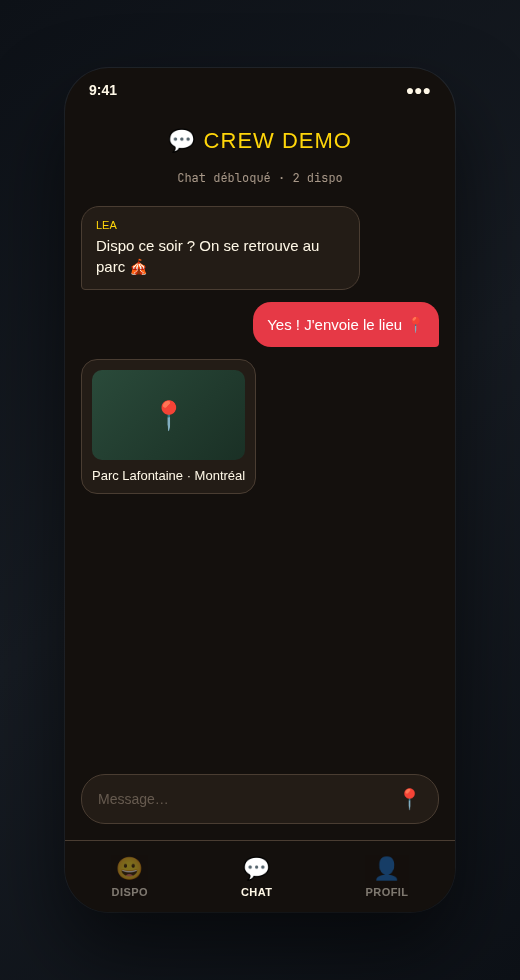
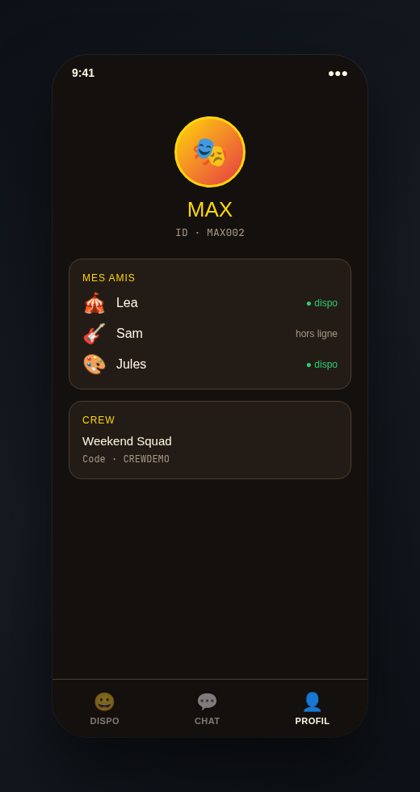

# Dispo 🎪

Dis à ton crew que **tu es dispo jusqu'à minuit** — en un tap. Chat débloqué dès qu'au moins une personne du groupe est disponible.

| Symbole | Sens |
|---------|------|
| 🟢 | Dispo jusqu'à minuit |
| 🔴 | Pas dispo |
| 💬 | Chat actif (≥ 1 dispo dans le crew) |
| 📍 | Lieu partagé dans le chat |

App Android **Kotlin / Compose** + API **FastAPI** (serveur local sur ton PC).

**Télécharger** : [Dispo v1.1.0 — APK](https://github.com/CloudDown/dispo/releases/latest)

---

## Installation rapide

### Android (APK)

1. Télécharge l'APK depuis [GitHub Releases](https://github.com/CloudDown/dispo/releases/latest).
2. Lance le backend sur ton PC (`./start.sh`) — téléphone et PC sur le **même Wi-Fi**.
3. Connecte-toi avec un compte démo : `LEA001` / `demo` (ou crée le tien).

### Développeur

```bash
git clone https://github.com/CloudDown/dispo.git
cd dispo/mobile_app
# Ouvrir mobile_app/ dans Android Studio
./release-github.sh     # build + publish APK
./configure-device-api.sh lan   # ou usb / emulator
```

Backend local :

```bash
./start.sh
# → http://localhost:8000/docs
```

---

## Les 3 écrans

### Accueil — bouton DISPO



Le cœur de l'app : un gros bouton central style **cirque / cartoon**.

- Tap → **dispo jusqu'à minuit** (vert) ou **pas dispo** (rouge)
- Animation « rings » Looney autour du bouton
- Widget home screen pour toggle sans ouvrir l'app

### Chat — crew & lieux



Messagerie de groupe, débloquée dès qu'**au moins 1** personne est dispo.

- Messages texte entre amis du crew
- Partage de **lieu** avec vignette carte (tuiles libres, sans clé API)
- Lien `google.com/maps` ouvrable dans Maps

### Profil — amis & crew



Gère ton identité et ton réseau.

- Avatar, pseudo, ID public (`MAX002`)
- Liste d'**amis** avec statut dispo en temps réel
- Crew : nom + code d'invitation

---

## API

| Préfixe | Rôle |
|---------|------|
| `/auth` | Register / login / profil (ID public) |
| `/friends` | Ajouter / lister / retirer par ID |
| `/groups` | Crews + codes d'invitation |
| `/availability` | Toggle « je suis dispo » |
| `/chat` | Messages de groupe |

Comptes démo : `LEA001` / `MAX002` / `SAM003` (mdp `demo`), crew `CREWDEMO`.

---

## Stack

| Couche | Techno |
|--------|--------|
| Mobile | Kotlin, Jetpack Compose, DataStore, Glance, osmdroid |
| API | FastAPI, SQLModel, JWT, SQLite |

Structure : `mobile_app/` + `server/`. Conventions agents : [AGENTS.md](AGENTS.md).
